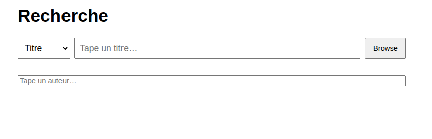
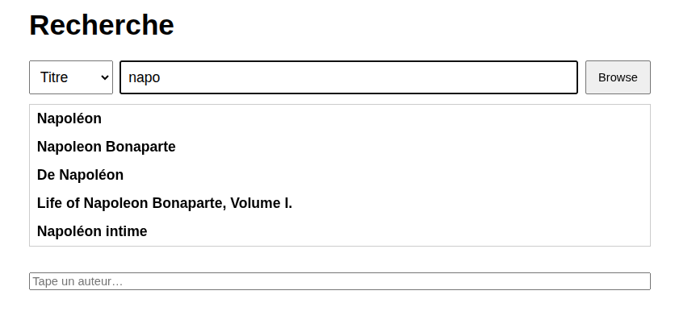
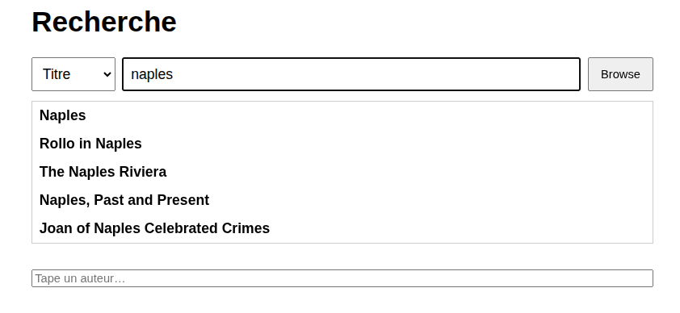
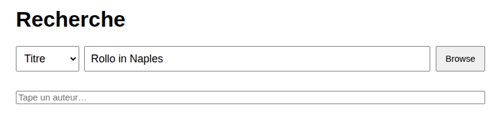
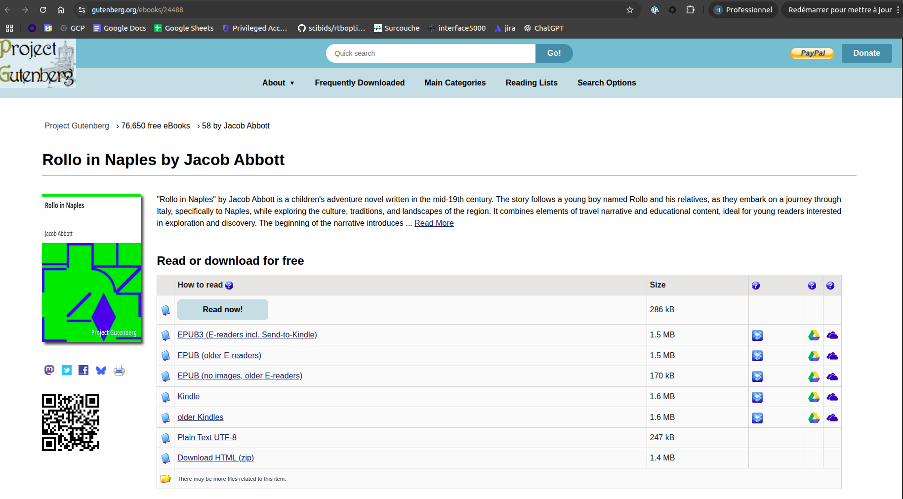
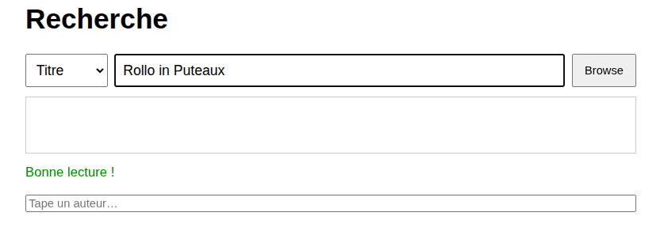
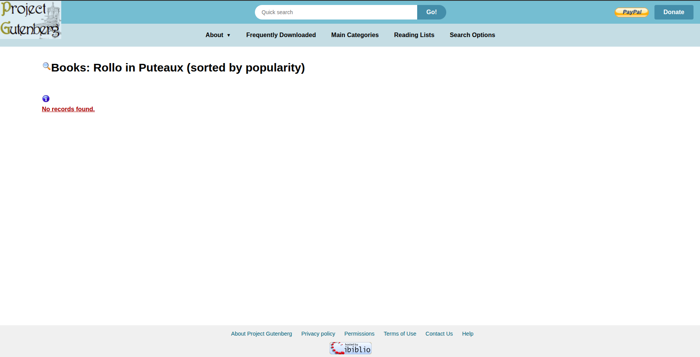
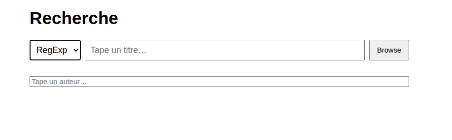
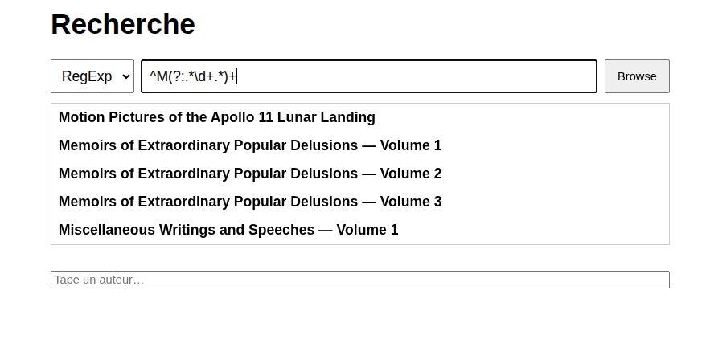
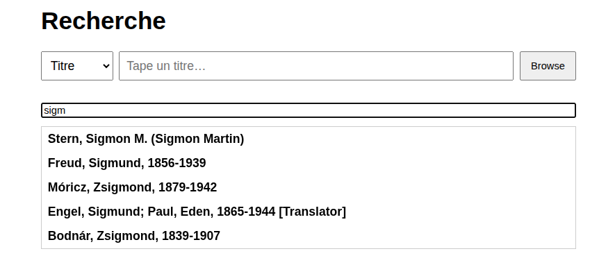

# steerlab_tt
Test technique process de recrutement chez Steerlab: [objectif]. Démonstration dans le cadre d’un entretien.


## Installation

* Créez un environnement Python 3.11.0 (exemple avec conda) :

```bash
conda create --name steerlab_tt python==3.11.0
conda activate steerlab_tt
```

* Clonez le repo:
```bash
git clone https://github.com/HippolyteKarakostas/steerlab_tt.git
cd steerlab_tt
```
* Installez les modules python, dépendances, puis installez le module steerlab_tt (en éditable):
```
pip install -r requirements.txt
pip install -e .
```

## Lancement de l'application

* Ouvrez un terminal et lancez la commande:
```bash
steerlab-tt
```
Ensuite, cliquez sur [ce lien](http://localhost:5000).

## Exemples d'utilisation

### Avec un titre
Vous arrivez alors sur la page suivante:

Vous pouvez rechercher un titre de livre en tapant dans la première barre de recherche.
L'image suivante montre ce qui se passe en commençant à chercher "napoléon":

L'application commence immédiatement (après au moins 3 caractères écrits) à suggérer des titres de livre.
Si aucune suggestion ne correspond à votre recherche, vous pouvez continuer à taper:

Si vous voyez le titre du livre que vous recherchez dans la liste, vous pouvez cliquer dessus

puis appuyer sur le bouton `Browse`. Vous serez alors redirigé vers la page du site du projet Gutemberg associée à ce livre

Vous pouvez toujours essayer de trouver un livre qui ne se trouve pas dans la liste

Le bouton `Browse` effectue alors la recherche du titre sur le site du projet Gutemberg à votre place


### Avec une expression régulière
Vous pouvez aussi chercher un titre de livre en écrivant directement une expression régulière, dans la même barre de recherche que précédemment.
Il faut alors cliquer sur le bouton `Titre` à gauche de cette barre.
Un menu déroulant apparaît alors. Il faut cette fois sélectionner `RegExp` et cliquer dessus.

Par exemple, vous pouvez rechercher la liste des livres qui commencent par un M et contiennent au moins un chiffre, en entrant l'expression régulière `^M(?:.*\d+.*)+` dans la barre.

L'autocomplétion suggérera alors 5 titres qui matchent cette expression régulière. Si votre livre s'y trouve, cliquez dessus comme précédemment et appuyez sur `Browse`. Sinon, essayez de raffiner votre expression régulière.

### Avec un nom d'auteur (ÉBAUCHE)
Il existe aussi une deuxième barre de recherche en-dessous la première. Pour l'instant, celle-ci ne permet pas d'effectuer des recherches sur le site du projet Gutemberg. Mais elle permet de trouver des noms d'auteurs grâce à de l'autocomplétion. Voici un exemple:
